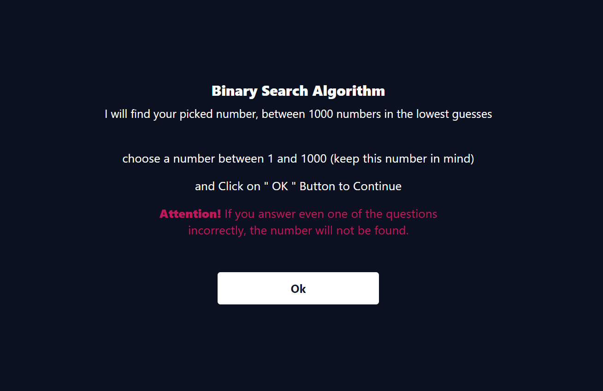
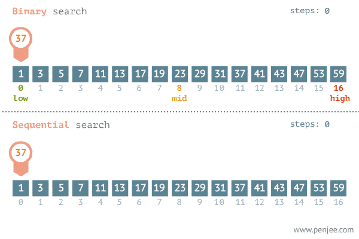
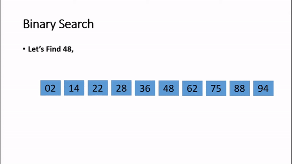

# Binary Search Algorithm



[](https://opensource.org/licenses/MIT)

[](https://github.com/amirallami-code/binary-search-algorithm/)


An efficient implementation of the binary search algorithm, optimized for rapid number searching.

## Table of Contents

- [Overview](#overview)
- [Features](#features)
- [How It Works](#how-it-works)
- [Demo](#demo)
- [Installation](#installation)
- [Usage](#usage)
- [Contributing](#contributing)
- [License](#license)
- [Contact](#contact)

## Overview

This repository houses a robust implementation of the binary search algorithm. Binary search is a highly efficient method for locating an item in a sorted list by systematically dividing the search interval in half.

## Features

- Lightning-fast search algorithm
- Optimized for numerical searches
- No manual input required for search targets
- Ideal for large datasets

## How It Works

Binary search operates on the principle of divide and conquer:

1. Initialize with the complete sorted list.
2. Compare the target value with the middle element.
3. If there's a match, the search concludes.
4. If the target is less than the middle element, repeat the search on the lower half.
5. If the target is greater, repeat the search on the upper half.
6. Continue this process until the target is found or the search space is exhausted.

This approach significantly reduces search time, especially in extensive datasets.

Here's a few examples of how this algorithm actually works

<p align="center">
  
</p>

<p align="center">
  
</p>

<div align="center">
  <a href="https://youtu.be/DRsJ8sA9xzc?si=JPRl0YHB3JSCaS_A">Gif ref</a>
</div>

## Demo

Experience the algorithm in action: [Binary Search Demo](https://binary-search-algorithm.vercel.app)

## Installation 

Clone the repository to your local machine: 
```bash 
      git clone https://github.com/amirallami-code/binary-search-algorithm.git cd binary-search-algorithm
```

## Usage

1. Execute the program.
2. Respond to the prompts accurately.
3. The algorithm will swiftly locate your number using binary search.

>**Note:** Precision in your responses is crucial; inaccurate inputs may lead to incorrect results.

## Contributing

We enthusiastically welcome contributions! To contribute:

1. Fork the project.
2. Create your feature branch (`git checkout -b feature/AmazingFeature`).
3. Commit your changes (`git commit -m 'Add some AmazingFeature'`).
4. Push to the branch (`git push origin feature/AmazingFeature`).
5. Open a pull request.

## License

This project is currently under the MIT license. For more information, see the [LICENSE](LICENSE) file.

## Contact

For questions or concerns, please contact:
Amirhossein Allami - [amirallami.dev@gmail.com](mailto:amirallami.dev@gmail.com)

Project Link: [https://github.com/amirallami-code/binary-search-algorithm](https://github.com/amirallami-code/binary-search-algorithm)

---

⭐ Star this repository if you find it helpful.